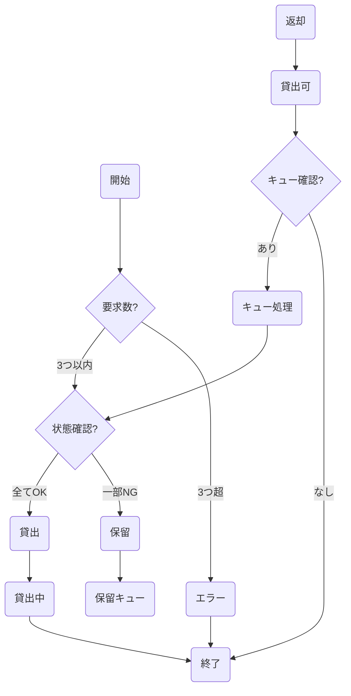

markdown

```mermaid
graph TD
    A(開始) --> B{要求数?};
    B -- 3つ以内 --> C{状態確認?};
    B -- 3つ超 --> D(エラー);
    C -- 全てOK --> E(貸出);
    C -- 一部NG --> F(保留);
    E --> G(貸出中);
    F --> H(保留キュー);
    I(返却) --> J(貸出可);
    J --> K{キュー確認?};
    K -- あり --> L(キュー処理);
    K -- なし --> M(終了);
    L --> C;
    G --> M;
    D --> M;

```
