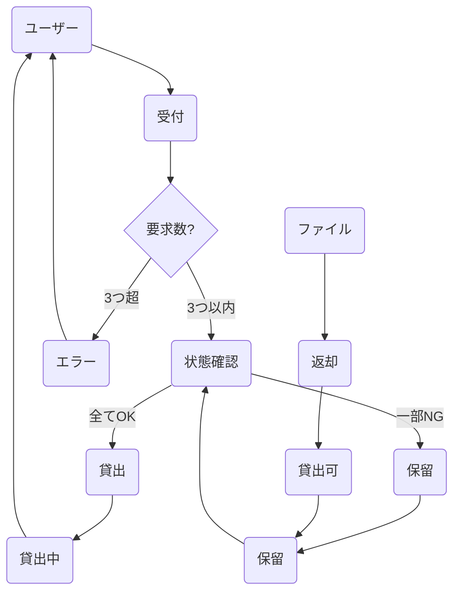

markdown

```mermaid

graph TD
    A(ユーザー) --> B(受付);
    B --> C{要求数?};
    C -- 3つ以内 --> D(状態確認);
    C -- 3つ超 --> E(エラー);
    D -- 全てOK --> F(貸出);
    D -- 一部NG --> G(保留);
    F --> H(貸出中);
    G --> I(保留);
    I --> D;
    H --> A;
    E --> A;
    J(ファイル) --> K(返却);
    K --> L(貸出可);
    L --> I;
```
