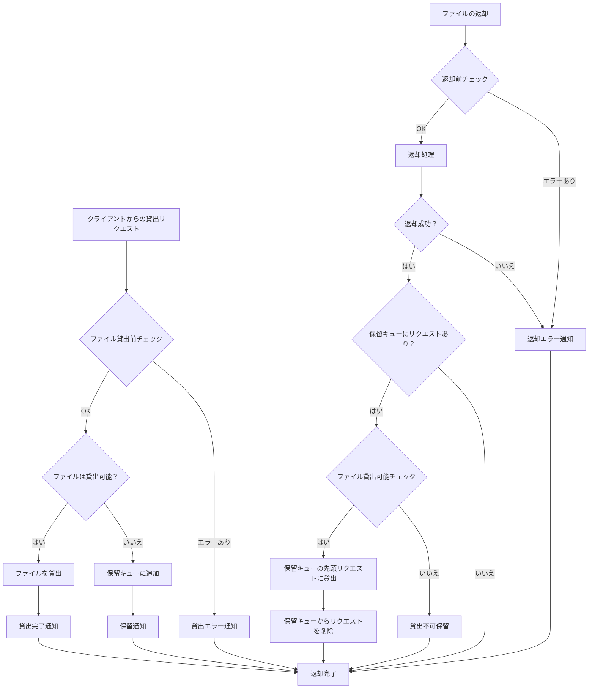

何度も聞き直してやっとでた。

markdown

```mermaid
graph TD
    A[クライアントからの貸出リクエスト] --> B{ファイル貸出前チェック};
    B -- OK --> C{ファイルは貸出可能？};
    B -- エラーあり --> D[貸出エラー通知];
    C -- はい --> E[ファイルを貸出];
    E --> F[貸出完了通知];
    C -- いいえ --> G[保留キューに追加];
    G --> H[保留通知];
    I[ファイルの返却] --> J{返却前チェック};
    J -- OK --> K[返却処理];
    J -- エラーあり --> N[返却エラー通知];
    K --> L{返却成功？};
    L -- はい --> M{保留キューにリクエストあり？};
    L -- いいえ --> N;
    M -- はい --> O{ファイル貸出可能チェック};
    O -- はい --> P[保留キューの先頭リクエストに貸出];
    O -- いいえ --> Q[貸出不可保留];
    P --> R[保留キューからリクエストを削除];
    R --> S[返却完了];
    M -- いいえ --> S;
    F --> S;
    D --> S;
    H --> S;
    N --> S;
    Q --> S;
```
